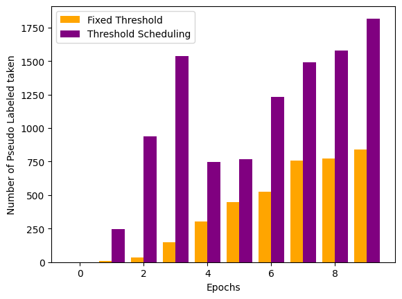
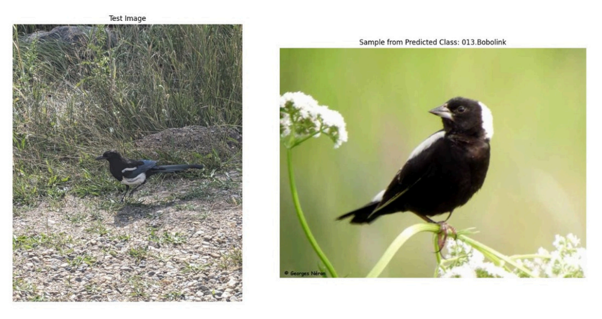

# Bird Species Classification using Pseudo Labeling and Threshold Scheduling

This repository implements a novel approach on the top of Pseudo labeling called 'Threshold Scheduling' for bird species classification using the CUB-200-2011 dataset. Our method enhances traditional pseudo-labeling by introducing a dynamic threshold momentum mechanism, achieving improved classification accuracy with limited labeled data.

## Objectives

- Train a semi-supervised model using only 40% labeled data
- Generate and refine pseudo-labels for the remaining 60% unlabeled data
- Implement novel threshold momentum for pseudo-label selection
- Achieve an accuracy comparable to the fully supervised baselines

## Dataset

We use the Caltech-UCSD Birds-200-2011 (CUB-200-2011) dataset, which contains:
- 200 bird species categories
- 11,788 images total
- 15 part locations per image
- 312 binary attributes per image
- Bounding box annotations

### Dataset Setup

1. Download the dataset:
```bash
# Create a data directory
mkdir data
cd data

# Download the CUB-200-2011 dataset
wget https://data.caltech.edu/records/65de6-vp158/files/CUB_200_2011.tgz

# Extract the dataset
tar -xzf CUB_200_2011.tgz
```

2. Create train/validation/test splits:
```python
# We use a 70:15:15 split ratio
train_size = 0.70
val_size = 0.15
test_size = 0.15
```

## Installation

```bash
# Clone the repository
git clone https://github.com/nyannbob/Improvised-Psuedo-Labels.git
cd git clone Improvised-Psuedo-Labels

# Install requirements
pip install -r requirements.txt
```

## Model Architecture

We use EfficientNet-B0 as our base model due to its:
- Balanced accuracy-efficiency trade-off
- Suitability for fine-grained visual tasks
- Resource-efficient training on consumer GPUs
- Mobile-friendly architecture

## Training stages

1. Initial Supervised Training
2. Pseudo-Label Generation with Threshold Momentum
3. Semi-Supervised Training

## Novel Threshold Momentum Approach

The approach for **pseudo-labeling with threshold scheduling** works by dynamically adjusting the threshold used for generating pseudo-labels based on the model's confidence (i.e., the average maximum probability of predictions). Here's a summary for the same:

1. **Calculate the average maximum probability** (`avg_max_prob`) from the model’s predictions.
2. **Threshold check**:
    - If the average probability is greater than or equal to a predefined **`max_threshold`**, adjust the threshold using a formula that incorporates the current threshold and the average probability.
    - If the average probability is lower, adjust the threshold accordingly.
3. **Incremental adjustments**:
    - If the threshold is increased, the increment is reset to a small value (e.g., 0.05).
    - If the threshold decreases, the increment is either halved or increased based on the comparison between the factor and the current threshold.
4. **Return the updated threshold and increment** values for further training.

This approach helps refine the pseudo-labeling process by gradually improving the model's ability to learn from the unlabeled data over time.

### Key Benefits:
- **Dynamic adjustment**: The threshold adapts to the model's performance.
- **Improved learning**: By updating the threshold and increment dynamically, the model can focus on high-confidence predictions while refining lower-confidence ones.


## Visual Results

Here are some visual results and insights from our project:

| **Pseudo-Label Distribution** | **Model Performance on real world data** |
|-------------------------------|-------------------------------|
|  |  |


## Contributors

- Nishant Kumar Singh 
- Aditya Rajesh Bawangade 
- Vikrant Suresh Tripathi (2103141)


## License

This project is licensed under the MIT License - see the [LICENSE](LICENSE) file for details.
